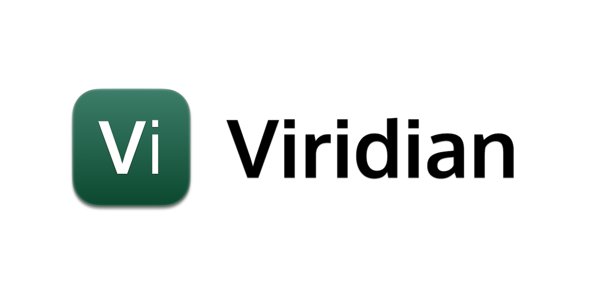

# Viridian
<p align="center">
    
</p>

[](https://github.com/MiclausCorp/Viridian/actions/workflows/codeql-analysis.yml)

A lightweight component-based framework for building web interfaces.

## Usage
Using Viridian can be as simple as importing it in your HTML code, and writing an element in a `<script>` tag.
```html
<!-- Viridian Active View -->
<div id="app"></div>

<!-- Viridian Import -->
<script src="./dist/libViridian.js"></script>

<!-- Viridian Interactive Applet -->
<script defer>
// Get the app container
const container = document.querySelector("#app");
  
// Create an element that returns the current date
var element = Viridian.createElement("h1", null, `It is currently ${Date()}.`)
  
// Render it in the app container.
Viridian.render(element, container);
</script>
```

## Components
Components are the basic building blocks for interfaces. They are independent and reusable bits of code. They serve the same purpose as JavaScript functions, but work in isolation and return HTML. Components can have an optional `props` argument.
```js
// Get the app container
const container = document.querySelector("#app");

// Function component that will return a greeting.
function Greeting() {
  return Viridian.createElement(
    "h1",                         // HTML h1 tag
    null,                         // Local props. (eg. HTML onClick="")                 
    `Hello, ${this.props.name}!`, // Returns greeting using a template.
  );
}

// Create Host element that passes the user name
var element = Viridian.createElement(Greeting, {name: "John"});

// Render it in the Interactive DOM Applet
Viridian.render(element, container);
```

### Props
A `prop` is an object which stores the value of attributes of a tag and work similar to the HTML attributes. It gives a way to pass data from one component to other components. They are similar to function arguments as props are passed to the component in the same way as arguments passed in a function.

## Rendering
Each Function Component typically returns an HTML fragment used to render the component. Viridian then uses its in-house custom built [Viridian FiberDOM® Reconciliation Engine](Source/FiberDOM) for DOM operations (viz. create-, update- & delete element), and will perform them when deemed necessary.

An element can be created and render it in an HTML container using:
```js
// Viridian Interactive Applet
const container = document.querySelector("#app");

// Viridian Component
const element = Viridian.createElement(component, props, ...children)

// Render the element in the DOM Container
Viridian.render(element, container)
```

For more information about the **Viridian FiberDOM Reconciliation Engine**, visit its [README.md](Source/FiberDOM/README.md) document.

## Interactivity Hooks
Interactivity Hooks are used to maintain state, and build in effects and lifecycle events. The Viridian FiberDOM® has more than a couple of useful built-in interactive hooks, namely:

- `$State` - which allows you to have state variables in functional components.
- `$Reference` - which allows you to persist values between renders.
- `$Effect` - which lets your component do something after rendering.
- `$Memoize` - which returns a memoized value.
- `$Callback` - which returns a memoized callback function.

For usage information about **Viridian FiberDOM Interactivity Hooks**, visit their [README.md](Source/Hooks/README.md) document.


## Interactive HTML (JSX)
Interactive HTML *(a.k.a JSX)* is an XML-like syntax extension to ECMAScript without any defined semantics. It's intended to be used by various preprocessors (transpilers) to transform these tokens into standard ECMAScript.

Viridian supports JSX thanks to the [Babel Transcompiler](https://babeljs.io/)

You can enable **Interactive HTML** / **JSX** support in your scripts by adding this line of code to the top of your script:
```js
/** @jsx Viridian.createElement */
```

#### Interactive HTML / JSX Demo
```html
<!-- Viridian Active View -->
<div id="app"></div>

<!-- Viridian Import -->
<script src="./dist/libViridian.js"></script>

<!-- Babel Transcompiler Drop-in -->
<script src="https://cdnjs.cloudflare.com/ajax/libs/babel-standalone/6.18.1/babel.min.js"></script>

<!-- Viridian Interactive Applet -->
<script defer type="text/babel">
/** @jsx Viridian.createElement */

// Get the app container
const container = document.querySelector("#app");
  
// Create an element that returns the current date
var element = <h1>Hello, world!</h1>;
  
// Render it in the app container.
Viridian.render(element, container);
</script>
```

For more information about **JSX** and **Interactive HTML**, visit the [React.js JSX  documentation](https://reactjs.org/docs/introducing-jsx.html).

## License
[MIT License](LICENSE)